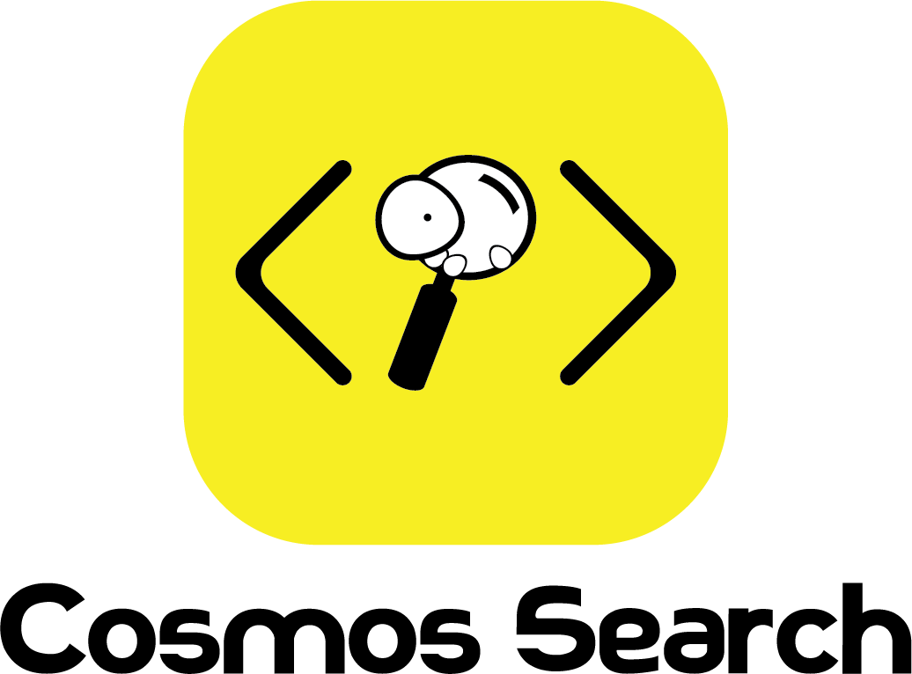

# Cosmos Search

# Contributors at OpenGenus

> Every work is great only because of its contributors

| [**Contributors :family_woman_boy_boy:**](#contributors-1) | [**Interns :dancer:**](#interns) | [**Maintainers :man_office_worker:**](#maintainers) |
|:---:|:---:|:---:|

To join our community, sign up at [our Discussion forum](https://discourse.opengenus.org/) and let us know your interests :sparkles: so we can help you better. 

## Contributors
Thanks goes to these ❤️ wonderful people who made this possible:

| [ Aditya Chatterjee](https://github.com/AdiChat)  | [ Vaibhav Shelke](https://github.com/vshelke)  | [ David Wu](https://github.com/Pl4gue)  | [ Vaibhav Singh](https://github.com/vaibhavsingh97)  | [ Hervé Beraud](https://github.com/4383)  |
| :---: | :---: | :---: | :---: | :---: |
[ Sakshee Jain](https://github.com/sakshee-19)  | [ Ernest Chang](https://github.com/iattempt)  | [ Divya Maddala](https://github.com/maddaladivya)  | [ Ankan Poddar](https://github.com/ankan17)  | [ Pratibha Goyal](https://github.com/Pratibha-Goyal)  |
[ Shweta Kumari](https://github.com/Shweta4321)  | [ Parthvi Vala](https://github.com/valaparthvi)  | [ Shikha Khatry](https://github.com/khatryshikha)  | [ Anannya Uberoi](https://github.com/anne27)  | [ Sarvani Deekshitula](https://github.com/sarvanideekshitula)  |
[ reallinfo](https://github.com/reallinfo)  | [ Rounak Vyas](https://github.com/itsron717)  |

### Interns

Wonderful interns at **OpenGenus** who worked on **Cosmos-Search**

| [ Rounak Vyas](https://github.com/itsron717)  |
| :---: | 

### Maintainers

Maintainers who look after **Cosmos Search**

| [ Aditya Chatterjee](https://github.com/AdiChat)  | [ Vaibhav Shelke](https://github.com/vshelke)  | [ Ernest Chang](https://github.com/iattempt)  | 
| :---: | :---: | :---: |
